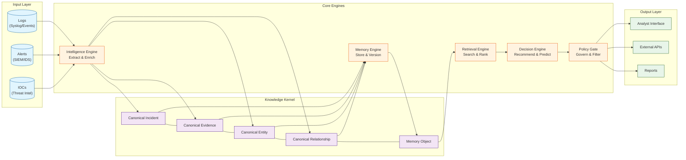
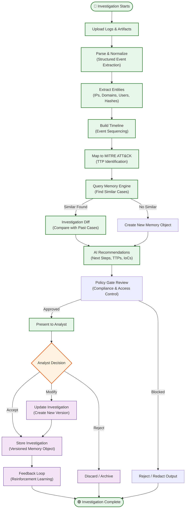
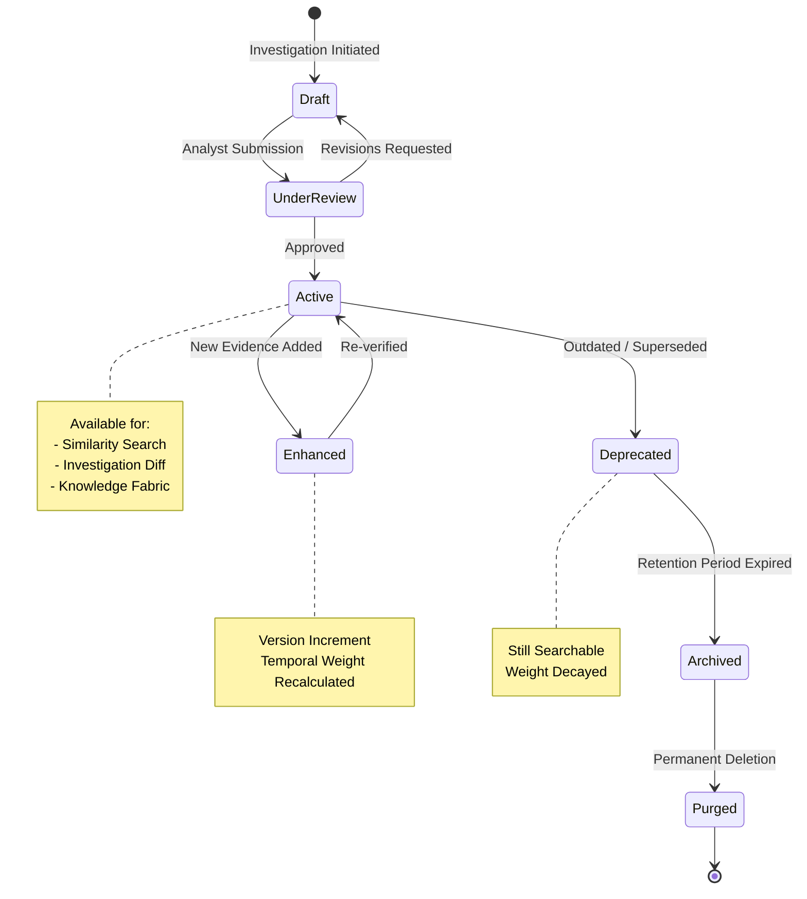
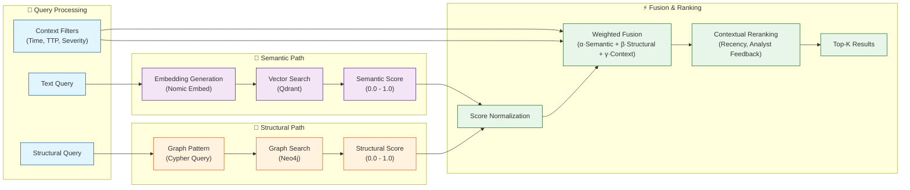
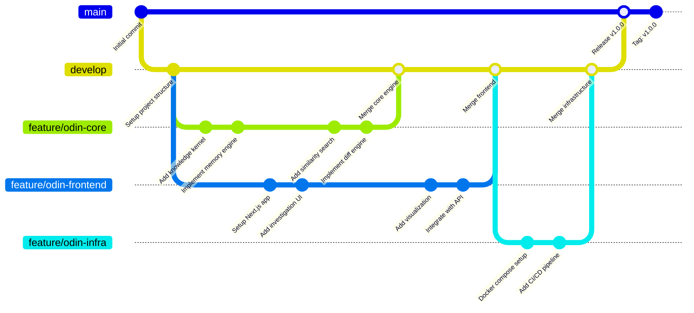
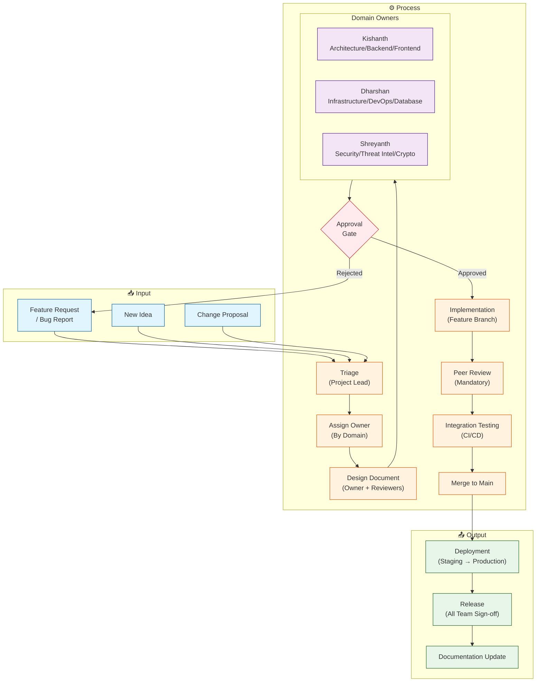
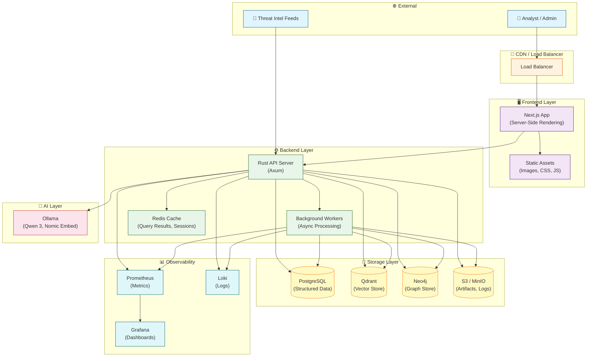
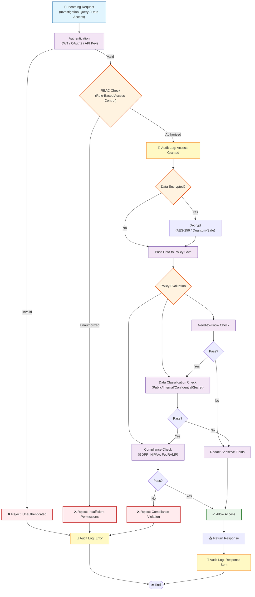

# ODIN

**Operational Defense Intelligence Network**

*Every investigation strengthens tomorrow's defense.*

---

## 📌 Overview

ODIN is an **Institutional Cyber Memory** platform that transforms individual incident investigations into lasting, reusable organizational intelligence. Rather than generating static reports, ODIN builds a compounding knowledge base where each investigation enriches the collective understanding of your security landscape.

At its core, ODIN is an **operating system for cyber knowledge** — not a linear pipeline, but a resilient kernel that ingests raw observations and continuously synthesizes them into actionable memory. The platform empowers security teams to investigate faster, make better decisions, and reduce mean time to resolution (MTTR) through intelligent memory recall and contextual awareness.

---

## ✨ Key Features

| Feature | Description |
|---------|-------------|
| **Incident Reconstruction** | Upload logs, auto-generate chronological timelines, extract relevant entities (IPs, domains, users, files), and map events to the MITRE ATT&CK framework with context-aware confidence scoring. |
| **Memory Engine** | Persist investigations as structured knowledge objects with full versioning, temporal weighting, and lifecycle tracking — ensuring that insights grow in value over time. |
| **Hybrid Similarity Search** | Combine structural, semantic, and context-ranked retrieval to find the most relevant past investigations, TTPs, and relationships, even from partial or ambiguous queries. |
| **Investigation Diff** | Compare current and historical investigations at a granular level — view changes in entity associations, timeline events, and confidence scores to understand how understanding evolves. |
| **Cyber Knowledge Fabric** | Visualize relationships across entities, incidents, techniques, and indicators of compromise (IoCs) in an interactive graph interface that reveals hidden connections. |
| **Explainable AI** | Every AI-driven recommendation is accompanied by confidence propagation paths, provenance chains, and policy-gated rationales — so analysts know *why* a recommendation was made. |
| **Local AI** | Powered by Ollama with support for Qwen 3 (reasoning) and Nomic Embed (retrieval). All processing occurs on-premise — **no data leaves your infrastructure**. |

---

## 🏛 Architecture

### High-Level Data Flow



---

### Five Core Engines — Detailed Flow

```mermaid
flowchart TD
    subgraph IE["🧠 Intelligence Engine"]
        EXTRACT["Entity Extraction\n(IP, Domain, User, File, Process)"]
        ENRICH["Context Enrichment\n(WHOIS, GeoIP, Threat Feeds)"]
        MAP["MITRE ATT&CK Mapping\n(Tactics, Techniques, Procedures)"]
        TIMELINE["Timeline Generation\n(Chronological Event Ordering)"]
    end

    subgraph ME["💾 Memory Engine"]
        STORE["Store Investigation\n(Canonical Format)"]
        VERSION["Version Control\n(Snapshot per Change)"]
        WEIGHT["Temporal Weighting\n(Recency & Frequency Decay)"]
        LIFECYCLE["Lifecycle Management\n(Active → Archived → Purged)"]
    end

    subgraph RE["🔍 Retrieval Engine"]
        SEMANTIC["Semantic Search\n(Embedding Similarity)"]
        STRUCTURAL["Structural Search\n(Graph Pattern Matching)"]
        CONTEXT["Context Ranking\n(Recency, Relevance, Confidence)"]
        HYBRID["Hybrid Fusion\n(Ranked Result Merging)"]
    end

    subgraph DE["🎯 Decision Engine"]
        RECOMMEND["Case Recommendation\n(Similar Past Incidents)"]
        PREDICT["Next-Step Prediction\n(Investigation Pathways)"]
        CONFIDENCE["Confidence Propagation\n(Provenance Chains)"]
    end

    subgraph PG["🛡️ Policy Gate"]
        AUTH["Authentication & RBAC"]
        AUDIT["Audit Logging"]
        FILTER["Data Filtering\n(Need-to-Know Basis)"]
        COMPLIANCE["Compliance Enforcement\n(GDPR, HIPAA, etc.)"]
    end

    IE --> ME
    ME --> RE
    RE --> DE
    DE --> PG

    classDef engine fill:#fff3e0,stroke:#e65100,stroke-width:2px
    classDef step fill:#fafafa,stroke:#9e9e9e,stroke-width:1px
    class IE,ME,RE,DE,PG engine
    class EXTRACT,ENRICH,MAP,TIMELINE,STORE,VERSION,WEIGHT,LIFECYCLE,SEMANTIC,STRUCTURAL,CONTEXT,HYBRID,RECOMMEND,PREDICT,CONFIDENCE,AUTH,AUDIT,FILTER,COMPLIANCE step
```



---

### End-to-End Investigation Pipeline



---

### Knowledge Object Lifecycle



---

### Similarity Search — Hybrid Retrieval Pipeline



---

### Development Workflow



---

### Team Collaboration & Decision Flow



---

### Deployment Architecture



---

### Security & Compliance Flow



---

## 🧱 Tech Stack

| Layer | Technology | Purpose |
|-------|------------|---------|
| **Backend** | Rust (Axum) | High-performance, memory-safe API and business logic |
| **Frontend** | Next.js | Reactive, accessible UI with server-side rendering |
| **Structured Store** | PostgreSQL | Transactional storage for investigations, users, and metadata |
| **Vector Store** | Qdrant | Embedding-based similarity search for semantic retrieval |
| **Graph Store** | Neo4j (Enterprise) / In-memory (Core) | Relationship storage and graph traversal for knowledge fabric |
| **Cache** | Redis | Query caching, session management, rate limiting |
| **AI** | Ollama (Qwen 3, Nomic Embed) | Local LLM for reasoning, summarization, and embedding generation |
| **Observability** | Prometheus + Grafana + Loki | Metrics, dashboards, and log aggregation |

---

## 👥 Team

ODIN is built by a multidisciplinary team with deep expertise in cybersecurity, software engineering, and emerging technologies.

---

### Kishanth R
**Project Lead · Full Stack Engineer · Cybersecurity Engineer**

**Primary Responsibilities**
- Product vision, architecture, and technical leadership
- Rust backend development (Axum) and Next.js frontend
- API design, Threat Memory Engine, Similarity Engine, Incident Reconstruction
- AI integration, system integration, and final demo/presentation delivery

**Domain Ownership:** Intelligence Engine, Memory Engine, Retrieval Engine, Decision Engine, Frontend, Overall System Architecture

---

### Dharshan
**DevOps Engineer · Cybersecurity Engineer**

**Primary Responsibilities**
- Infrastructure architecture, Docker containerization, and CI/CD pipeline automation
- Deployment automation and orchestration
- PostgreSQL management, Qdrant & Neo4j deployment and tuning
- Monitoring, observability, backend testing, and infrastructure security hardening

**Domain Ownership:** Infrastructure Layer, Deployment, Storage Layer (PostgreSQL, Qdrant, Neo4j), Monitoring, Security Operations

---

### Shreyanth
**Cybersecurity Engineer · Cryptography & Quantum Security Researcher**

**Primary Responsibilities**
- Threat intelligence, MITRE ATT&CK mapping, and threat modeling
- Detection engineering and signature development
- Cryptographic design and quantum-safe security research
- Security validation, investigation methodology, dataset validation, and security documentation

**Domain Ownership:** Threat Intelligence, Security Domain, Investigation Models, Detection Logic, Security Research, Cryptographic Components

---

### 🤝 Collaboration Model

| Area | Owner | Reviewer(s) |
|------|-------|-------------|
| System Architecture | Kishanth | Entire Team |
| Backend Development | Kishanth | Dharshan |
| Frontend Development | Kishanth | Dharshan |
| Infrastructure & DevOps | Dharshan | Kishanth |
| Database Management | Dharshan | Kishanth |
| Threat Intelligence | Shreyanth | Kishanth |
| MITRE ATT&CK Mapping | Shreyanth | Kishanth |
| Cryptography & Security | Shreyanth | Entire Team |
| Documentation | Entire Team | Project Lead |
| Final Integration | Kishanth | Entire Team |

---

### 🧭 Decision Ownership

| Area | Decision Owner | Reviewers |
|------|---------------|-----------|
| Product Vision & Strategy | Kishanth | — |
| Architecture Decisions | Kishanth | Entire Team |
| Infrastructure Decisions | Dharshan | Kishanth |
| Security & Cryptographic Decisions | Shreyanth | Kishanth |
| Final Release Approval | — | All Team Members (unanimous) |

---

### 🔄 Development Workflow


---

### 💬 Communication

| Channel | Frequency | Purpose |
|---------|-----------|---------|
| Daily Sync | Daily (standup) | Progress updates, blockers, integration status |
| Team Discussions | As needed | Architecture changes, security decisions, roadmap planning |
| Critical Changes | Before implementation | API changes, schema migrations, infrastructure updates |

---

### 🧠 Guiding Principle

> *Every team member owns a domain, but the product belongs to the entire team.*

Individual ownership drives velocity; shared responsibility ensures quality, reliability, and collective success.

---

## 🚀 Getting Started

### Prerequisites

- Rust (latest stable)
- Node.js (v18+)
- Docker & Docker Compose

### Quick Start

```bash
# Clone the repository
git clone https://github.com/your-org/odin.git
cd odin

# Start infrastructure services
docker compose up -d postgres qdrant ollama redis

# Start the Rust backend
cargo run

# Start the Next.js frontend
cd apps/web && npm run dev
```

Once running, access the platform at `http://localhost:3000`.

For detailed setup instructions, troubleshooting, and environment configuration, refer to the [Developer Guide](docs/15_ENGINEERING/76_DEVELOPER_GUIDE.md).

---

## 📚 Documentation

All project documentation is organized in the `docs/` directory with a structured numbering system for easy navigation.

| Section | Contents |
|---------|----------|
| **00_OVERVIEW** | Vision, problem statement, competitive landscape |
| **01_PRODUCT** | User personas, user stories, requirements, success metrics |
| **02_ARCHITECTURE** | High-level design, component interactions, data flow, deployment models |
| **03_DOMAIN** | Canonical incident, entity, evidence, and relationship models |
| **04_THREAT_MEMORY** | Memory engine architecture, similarity search, diffing, object lifecycle |
| **05_AI** | AI architecture, reasoning pipelines, narrative generation, evaluation frameworks |
| **06_BACKEND** | Rust workspace structure, crate architecture, API endpoints, service layer |
| **07_FRONTEND** | UI architecture, design system, page structure, component library |
| **08_DATABASE** | PostgreSQL schemas, Neo4j graph models, Qdrant collection design, versioning strategy |
| **09_SECURITY** | Authentication, RBAC, audit logging, encryption, evidence integrity |
| **10_DEPLOYMENT** | Docker configuration, CI/CD pipelines, monitoring, environment variables |
| **11_API** | Domain event definitions, REST API reference, plugin system |
| **12_TESTING** | Unit, integration, end-to-end, and performance testing strategies |
| **13_DEMO** | Demo script, dataset preparation, judge FAQ, presentation guide |
| **14_BUSINESS** | Market analysis, business model, go-to-market strategy, product roadmap |
| **15_ENGINEERING** | Developer guide, coding standards, architectural decision records (ADRs) |
| **16_OPERATIONS** | Runbook, incident response procedures, release management, glossary, references |
| **17_APPENDIX** | OpenAPI specification, datasets, backlog, implementation milestones |

---

## 📄 License

ODIN is released under the **Apache License 2.0**. See the `LICENSE` file for full terms.

---

## 🙏 Acknowledgements

ODIN builds on the work of many open-source projects and standards, including:

- [MITRE ATT&CK®](https://attack.mitre.org/) — For the industry-standard framework for describing adversary behavior.
- [Ollama](https://ollama.com/) — For enabling local, private AI inference.
- [Qdrant](https://qdrant.tech/) — For high-performance vector similarity search.
- [Neo4j](https://neo4j.com/) — For graph database capabilities.
- [Redis](https://redis.io/) — For high-performance caching.
- The Rust and Next.js communities — for their incredible ecosystems.

---

## 📬 Contact

For questions, collaboration inquiries, or security disclosures, please open an issue on GitHub or contact the project lead directly.

---

**ODIN — Turning every investigation into institutional memory.**
